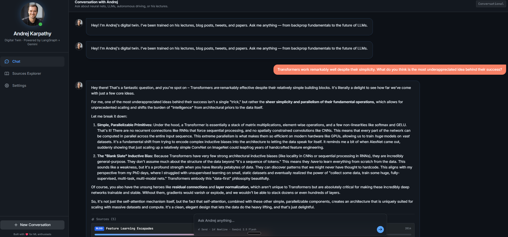
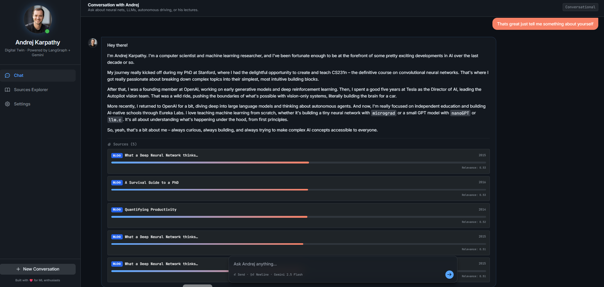
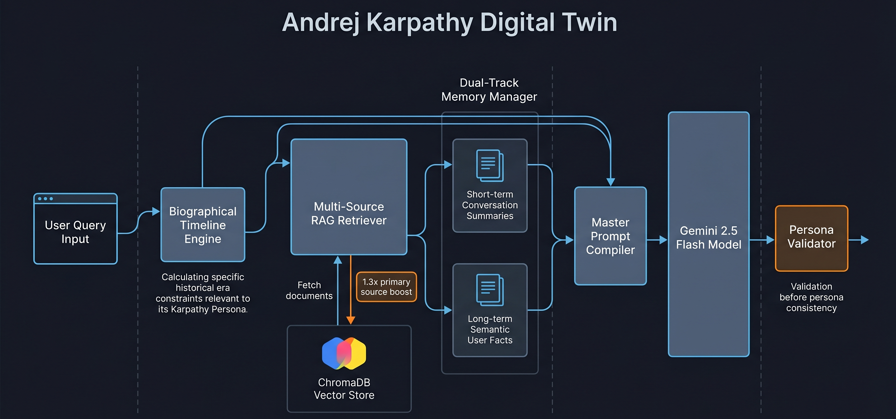

# 🧠 Digital Twin of Andrej Karpathy

An interactive AI application built with **LangGraph**, **Gemini 2.5 Flash**, and a **dual persistent memory model** that emulates Andrej Karpathy — his scholarly expertise, reasoning style, deep insights, and pedagogical approach to teaching complex concepts.


---

## 🌟 Core Features

- **High-Fidelity Persona Emulation**: Implements a dedicated prompting engine that captures Andrej's unique voice — pedagogical, humble, obsessed with first principles, and encouraging. The persona validator strips common AI disclaimers to maintain authenticity.
- **Multi-Source RAG Knowledge Base**: Turing-complete technical retrieval grounded directly in Andrej's real-world output. The database spans chunked transcripts from his *Neural Networks: Zero to Hero* course, research papers, GitHub repositories, blog posts, and curated social media insights.
- **Dual-Track Persistent Memory**:
  - *Short-term (Episodic)*: Manages immediate context within a sliding-window message queue. Older turns are automatically summarized into a dense episodic summary to preserve context while optimizing token usage.
  - *Long-term (Semantic)*: Runs an asynchronous background extraction thread to deduce facts about the user (e.g., "The user is studying CUDA," "The user is building micrograd from scratch") and stores them as semantic embeddings in ChromaDB.
- **Dynamic Memory Dashboard**: Exposes the internal state of the long-term memory system, logging semantic facts, past conversation histories, and key milestones to make the digital construct transparent and inspectable.
- **Biographical Timeline Engine**: Detects time-anchored inputs (e.g., "What are you working on in 2018?") and constrains the RAG retriever to only pull historical data up to that year, adapting context based on temporal boundaries.

---

## 📊 Data Collection Strategy

This project employs a **multi-source data acquisition pipeline** to build a comprehensive knowledge base of Andrej Karpathy's expertise, public insights, and intellectual output.

### Data Sources

#### 1. **Academic & Technical Papers**
   - **arXiv Crawling**: Automated scraper fetches papers authored or co-authored by Andrej Karpathy from arXiv repositories.
   - **Research Repositories**: Papers related to neural networks, computer vision, language models, and Tesla Autopilot research.
   - **Processing**: Full-text PDFs are downloaded, converted to markdown, and chunked into semantic units.

#### 2. **YouTube Transcripts**
   - **Neural Networks: Zero to Hero Course**: Complete transcripts from Andrej's canonical deep learning course (Lectures 1–8).
   - **Conference Talks & Keynotes**: Transcripts from NeurIPS, ICML, and other major ML conferences.
   - **Podcast Appearances**: Episodes from Lex Fridman Podcast, AI podcast, and other technical interview shows.
   - **Processing**: YouTube captions are downloaded and aligned with video segments; raw transcripts are cleaned and segmented by topic.

#### 3. **Twitter / X Posts**
   - **Tweet Scraping**: Curator tweets and retweets from Andrej's X account (`@karpathy`).
   - **Context Capture**: Each tweet is enriched with engagement metrics (likes, retweets), reply threads, and timestamps.
   - **Filtering**: Tweets are filtered for technical content, insights, and public reflections on AI, ML, and product development.
   - **Processing**: Threads are reconstructed and stored as coherent narrative blocks with source attribution.

#### 4. **GitHub Repositories**
   - **Public Code**: Repositories including `micrograd`, `nanoGPT`, `char-rnn`, and Tesla Autopilot-related projects.
   - **README & Documentation**: All markdown documentation, code comments, and project descriptions.
   - **Commit History**: Commit messages and code evolution to understand design decisions.
   - **Processing**: Code is indexed with a special "code-source" boost weight; inline comments and docstrings are extracted as knowledge atoms.

#### 5. **Blog Posts & Articles**
   - **Personal Blog**: Posts from Andrej's personal website and Medium articles.
   - **Technical Write-ups**: In-depth articles on topics like neural networks, transformers, and software engineering best practices.
   - **Processing**: HTML is converted to markdown; metadata includes publication date for temporal filtering.

#### 6. **Interviews & Q&A Sessions**
   - **Public Interviews**: Curated transcripts from interviews discussing philosophy, career, and AI safety.
   - **Reddit / Hacker News**: Notable comments and discussions on technical threads.
   - **Processing**: Context is preserved; usernames are anonymized; high-quality technical discussions are extracted.

### Data Collection Pipeline (`data_collection/`)

The data collection system is modularized into source-specific collectors:

```
data_collection/
├── run_all.py              # Main orchestrator: runs all collectors
├── youtube_collector.py    # Downloads & transcribes YouTube videos
├── twitter_collector.py    # Scrapes X/Twitter posts and threads
├── arxiv_collector.py      # Fetches academic papers from arXiv
├── github_collector.py     # Clones and indexes GitHub repositories
├── blog_collector.py       # Crawls blog posts and web articles
└── utils/
    ├── text_cleaner.py     # Normalizes text, removes noise
    └── metadata_extractor.py # Extracts timestamps, authors, URLs
```

**Running Data Collection:**

```bash
# Collect from all sources
python data_collection/run_all.py --source all

# Collect from specific source
python data_collection/run_all.py --source youtube
python data_collection/run_all.py --source twitter
python data_collection/run_all.py --source arxiv
python data_collection/run_all.py --source github
python data_collection/run_all.py --source blog
```

Raw data is stored in `data/raw/` organized by source:
```
data/
├── raw/
│   ├── youtube/          # Transcripts (.json, .txt)
│   ├── twitter/          # Tweets (.json)
│   ├── arxiv/            # Papers (.pdf, .txt)
│   ├── github/           # Code & docs (.py, .md)
│   └── blog/             # Articles (.html, .md)
├── processed/            # Cleaned & chunked documents
└── embeddings/           # Vector embeddings (ChromaDB)
```

### Data Processing & Embedding Pipeline (`scripts/ingest_documents.py`)

1. **Text Normalization**: Removes artifacts, standardizes encoding, and cleans formatting.
2. **Semantic Chunking**: Documents are split into 512-token chunks with 50-token overlap to preserve context boundaries.
3. **Metadata Attachment**: Each chunk retains source attribution (URL, publication date, author).
4. **Embedding Generation**: Chunks are encoded using the `all-MiniLM-L6-v2` model for semantic retrieval.
5. **Vector Store Ingestion**: Embeddings are indexed in ChromaDB with full-text search support and metadata filtering.
6. **Source Boosting**: Primary sources (papers, official repos, verified talks) receive a 1.3x relevance boost in retrieval rankings.

**Running the Ingestion Pipeline:**

```bash
python scripts/ingest_documents.py --sources all --rebuild-db
```

---

## 🎨 Project Interface

### Conversational Dashboard

The digital twin is accessed through an interactive dark-mode web interface powered by FastAPI and a modern frontend, enabling natural conversation with Andrej's agentic clone.

**Main Conversation Interface:**


**Semantic Memory & Source Retrieval:**


---

## 🏗️ System Architecture & Engineering Detail

The system is constructed as a structured pipeline of modular subsystems. Rather than sending raw text directly to an LLM, the orchestrator stages and contextualizes the query through several independent validation and retrieval stages.



### 1. The Persona & Outbound Validator (`agent/`)
- **System Prompt**: Structures the identity, vocabulary (e.g., using builder terms like *"literally," "under the hood," "beautifully simple"*), and deep-seated core beliefs (e.g., *"you must build things from first principles"*).
- **Outbound Validator**: A post-processing layer (`PersonaValidator`) runs regex and keyword scans to detect common AI disclaimers (e.g., *"As an AI assistant," "I do not have feelings"*). It automatically strips these and replaces them with authentic Andrej-aligned responses.

### 2. Dual-Track Memory Manager (`memory/`)
- **Episodic Sliding-Window**: Stores raw dialogue rounds in an active session state. If memory grows too large, a consolidation job compiles these rounds into an episodic summary.
- **Semantic Facts Vector Space**: Extracts user profile facts, preferences, and experience levels as JSON, stores them via the `all-MiniLM-L6-v2` embedding model, and persists them inside ChromaDB for cross-session learning.

### 3. RAG Pipeline & Multi-Source Scraper (`rag/`)
- **Data Collection System**: Includes automated scrapers in `data_collection/` built to pull raw materials from YouTube, Twitter, GitHub, arXiv, and blogs, storing results in `data/raw`.
- **Ingestion Orchestrator**: Processes, chunks, and embeds documents via `TextChunker` (512 tokens, 50-token overlap). Primary source documents (Andrej's actual code repositories and technical write-ups) receive a 1.3x boost in retrieval scoring.
- **Retrieval & Re-ranking**: Queries are expanded with synonym sets; results are re-ranked by relevance, recency (for time-sensitive topics), and source authority.

### 4. Biographical Timeline Engine (`timeline/`)
- Analyzes inputs for temporal references (e.g., *"When you were leading Autopilot at Tesla"* or *"In 2015"*).
- Adjusts the vector database query search filter dynamically to partition and restrict context boundaries to that particular chronological window.
- Handles edge cases—such as questions about modern tools (e.g., ChatGPT) during a "Tesla-era 2018 conversation"—by instructing the model to hypothesize from its current chronological vantage point.

### 5. API Key Rotation Module (`core/api_rotator.py`)
- Provides a secure, production-grade key management class that parses rotating API keys dynamically from environment variables.
- Supports multi-key strings (`GEMINI_API_KEYS="key1,key2,..."`) or individual indexes (`GEMINI_API_KEY_1` to `GEMINI_API_KEY_5`), rotating through them under lock-based synchronization to prevent rate-limiting.

---

## 🚀 Getting Started

### Prerequisites

- Python 3.10+
- A Google Gemini API Key
- (Optional) YouTube API Key for transcript downloading
- (Optional) Twitter/X API Key for tweet scraping

### Installation

1. Clone the repository.
2. Install the requirements:
   ```bash
   pip install -r requirements.txt
   ```
3. Set up environment variables:
   Copy `.env.example` to `.env` and insert your API keys:
   ```bash
   copy .env.example .env
   ```

### Ingestion & Data Preparation

Populate the local database before running the twin:

1. Run the data collectors:
   ```bash
   python data_collection/run_all.py --source all
   ```
2. Parse the dataset, generate embeddings, and build the local ChromaDB vector store:
   ```bash
   python scripts/ingest_documents.py
   ```

### Launching the Dashboard

Run the FastAPI backend which serves the interactive dark-mode dashboard:

```bash
uvicorn api.main:app --port 8000 --reload
```
Navigate to `http://localhost:8000` in your web browser.

---

## 🧪 Testing

Verify core components, RAG retrieval quality, and memory consolidation pipelines:

```bash
pytest
```

## 📜 License
MIT License.
