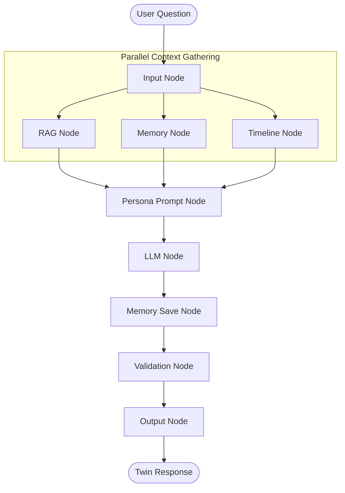

# Architecture — Andrej Karpathy Digital Twin

This document provides a detailed overview of the system architecture, data flow, and components of the Digital Twin.

## 🏗️ System Overview

The Andrej Karpathy Digital Twin is built on a modular RAG (Retrieval-Augmented Generation) design, orchestrated using a LangGraph StateGraph, and backed by a dual persistent memory system.

---

## 🧩 Key Architectural Components

### 1. LangGraph Orchestrator (`agent/`)
The agent's logic is defined as a directed acyclic graph (DAG) where nodes perform transformations on the shared `AgentState` and return the modified state.
* **Concurrency:** The graph runs `rag_node`, `memory_node`, and `timeline_node` concurrently to fetch all necessary context before prompt construction, optimizing execution time.
* **Sliding Window:** State history is saved automatically using LangGraph's native `MemorySaver` checkpointer.

### 2. Dual Memory System (`memory/`)
Coordinates short-term and long-term storage layers:
* **Short-Term Memory:** Implements a sliding window (default 10 turns) in RAM. Older messages are buffered for background compression.
* **Long-Term Memory:** Uses semantic collections in ChromaDB (and a local JSON database fallback) to query and persist user facts, episodic conversation summaries, and important moments.
* **Consolidator:** Uses Gemini 2.5 Flash to periodically compress dialogue history, extract structured facts about the user, and identify significant milestones.

### 3. Timeline Engine (`timeline/`)
Parsed at query time to keep the agent aware of Andrej's different career phases (e.g. Stanford PhD, Tesla Autopilot, OpenAI, Eureka Labs).
* **Search Filters:** If the query mentions a specific period (e.g. "when you were at Tesla") or year (e.g. "in 2018"), it sets a custom filter on the ChromaDB retrieval to only fetch documents from that specific timeframe, boosting retrieval accuracy.

### 4. Persona Validation Layer (`agent/persona_validator.py`)
Intercepts raw LLM outputs to filter out robotic AI boilerplate (e.g. "As an AI model...", "Here is the information you requested...") and automatically corrects minor formatting errors to preserve Andrej's down-to-earth, educational tone.
